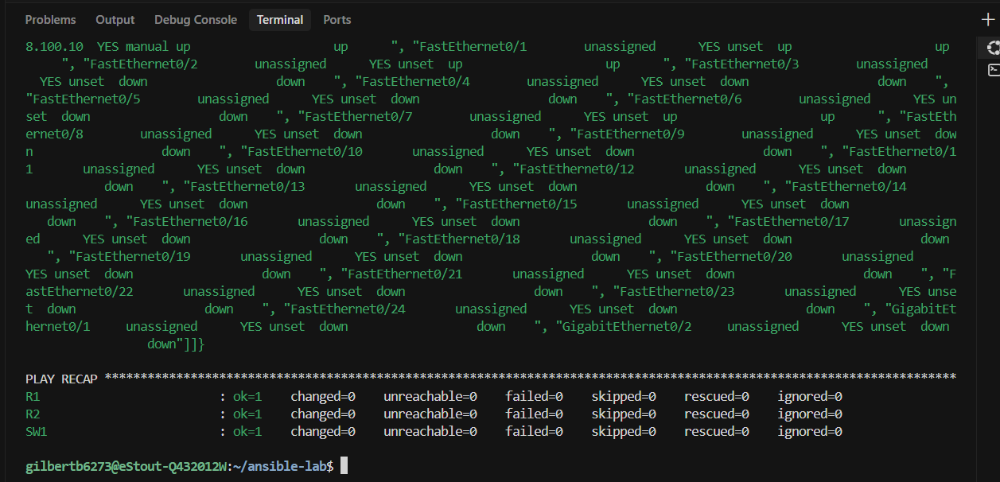
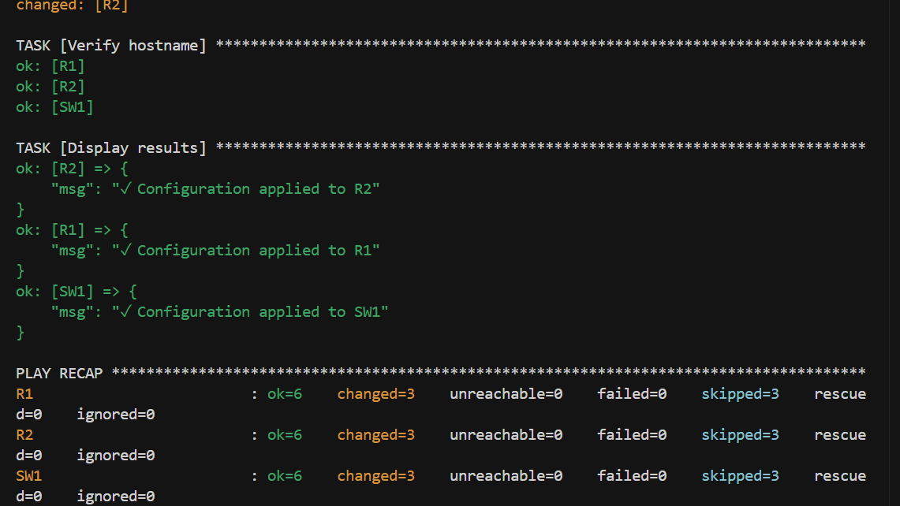
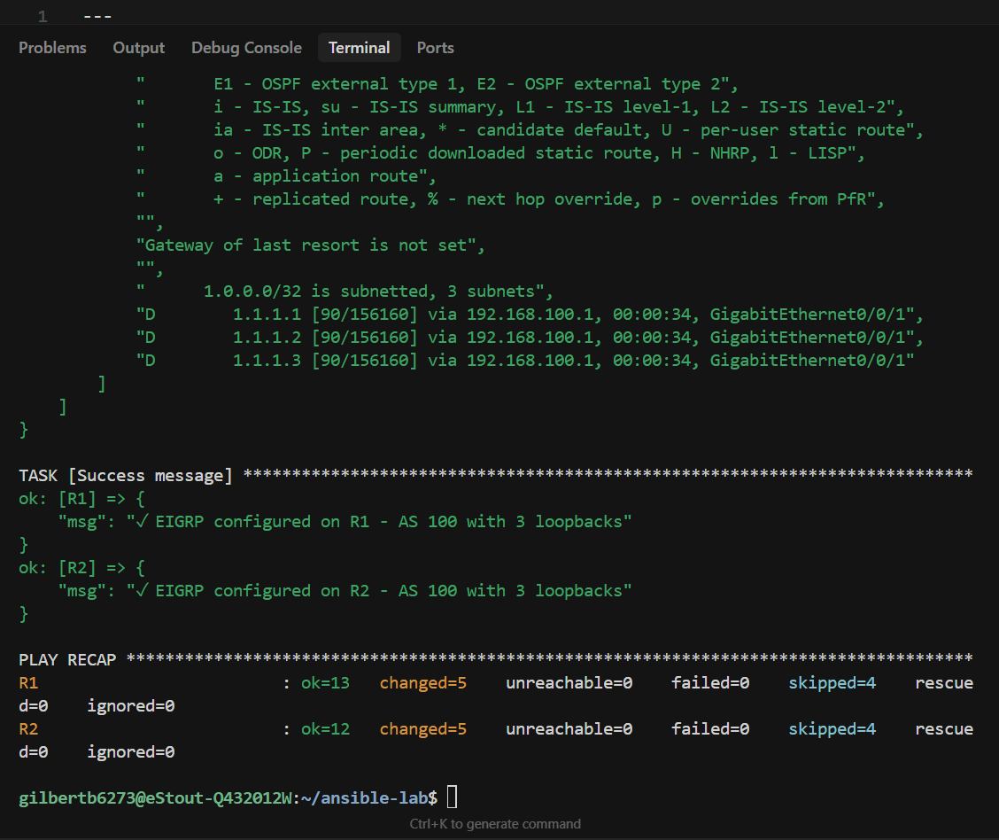
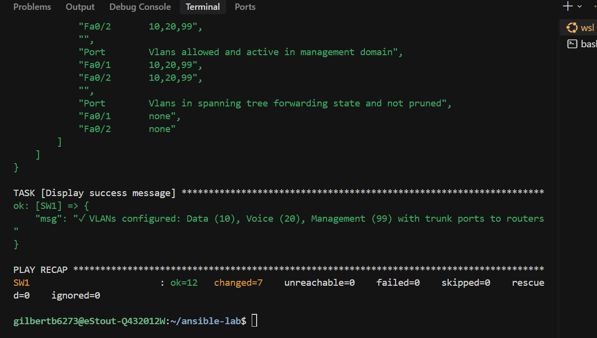
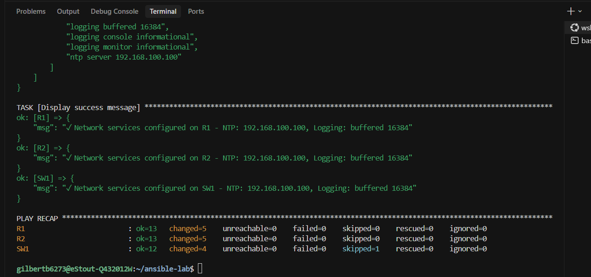
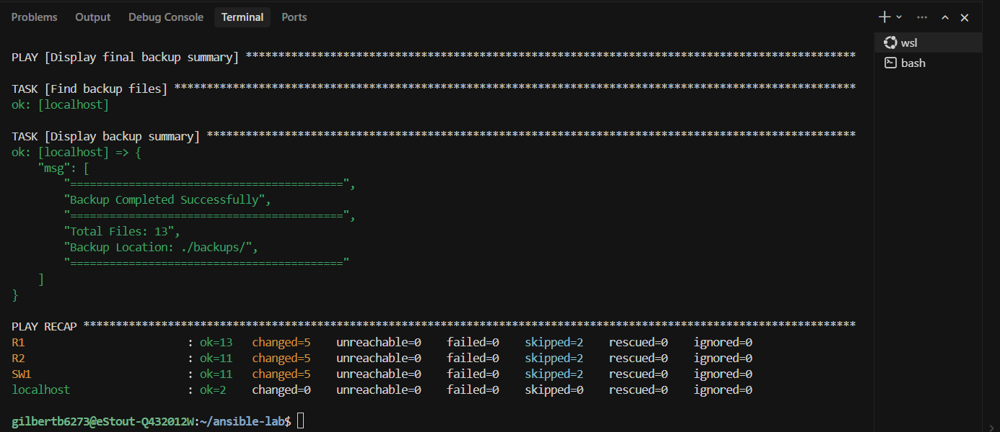
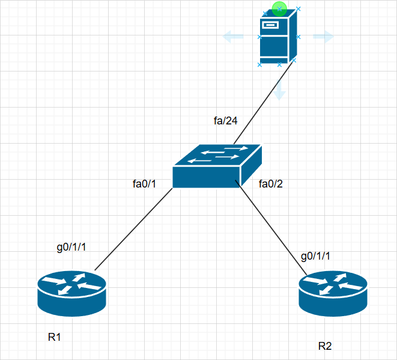
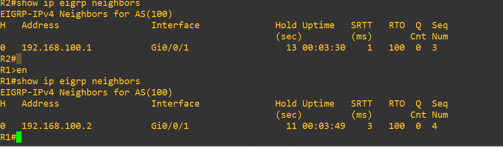
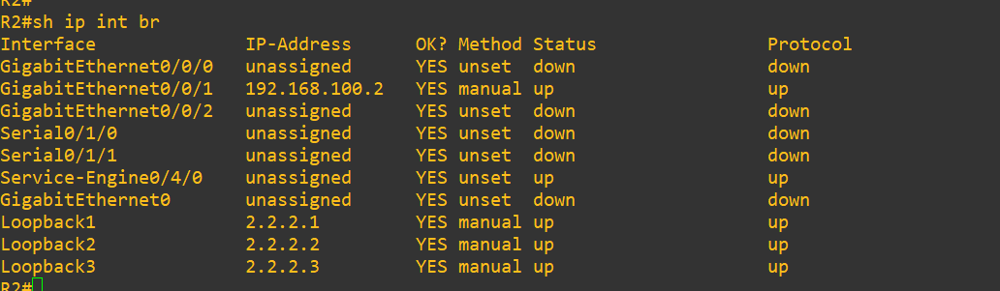
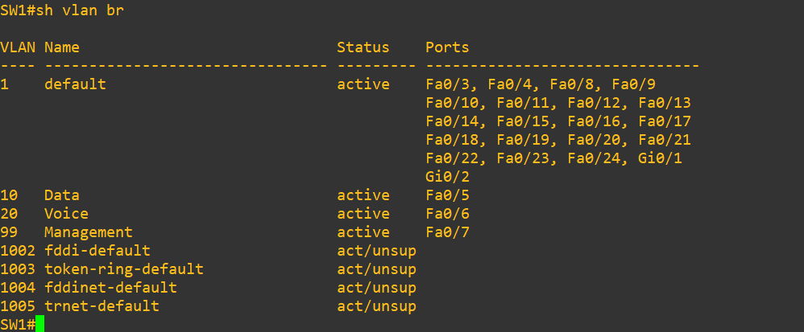

# Testing Results

This document contains screenshots of playbook executions.

---

## 1. Playbook Runs

### Playbook 1: Verify Connectivity

### Playbook 2: Base Configuration

### Playbook 3: EIGRP + Loopbacks

### Playbook 4: VLAN Configuration

### Playbook 5: Network Services

### Playbook 6: Backup Configuration

---

## 2. Network Diagram

---

## 3. Final Verification Screenshots

### EIGRP Neighbors

### Loopback Interfaces

### VLANs on Switch

